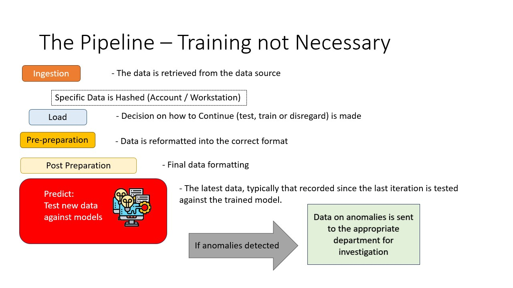

# Introduction 
The goal is to design individualized anomaly detection models on a per user basis (starting with a few users and scaling to the whole agency). We want to have high accuracy models (95%+) with a low false positive and false negative rate. The objective is to flag those lock/unlock actions that are most likely to be an anomaly and indictive of an early stage of an attempted system compromise. Assuming a low false positive rate, this would streamline the alerting that the incident response team needs to tackle and address, thus maximizing limited staff time.

# Repo Directory Structure
The repo is split into several folders for easier maintenance.
1. .artifacts: contains OpenShift artifacts including YAML files to automate workflows.
2. src: contains any code (Python scripts) used for machine learning workloads like preprocessing data or model training.
3. docs: contains any Markdown files or other documentation used to describe the project.
4. pipelines: contains MLOps pipeline definitions.
5. tests: contains unit and integration tests used to detect bugs and issues in the code.
6. notebooks: contains Jupyter notebooks, mostly used for experimentation.
7. data: stores local data files and outputs of different scripts.
8. tests: stores Python test cases and scripts.

# Project Architecture and Python Scripts

The flow of data will be split into two pipeline paths: one for user data being sent to already trained models for predictions and the other for training models for each user. The below sections break out the order and names of the scripts used for each path. An image also shows how these two paths will work visually.

### Path for user data for users that do not have trained models.
`ingest.py` -> `load.py` -> `preprep_NoModels.py` -> `syndatagen.py` -> `postprep_NoModels.py` -> `train.py` -> `savemodels.py`

 
### Path for user data for users that do have trained models
`ingest.py` -> `load.py` -> `preprep_Models.py` -> `postprep_Models.py` -> `predict.py`

The next sections visualize and describe each process as well as the scripts involved.

### Data Ingestion (`ingest.py`)

The first step of the process is to collect and ingest data that will be used for model training and predictions. Currently, we use an ingestion Python script called `ingest.py`. This script executes a series of post and get requests (written as functions) to the Splunk on-prem API endpoint. The destination is a load balancer that will then pass on the requests to a server within the cluster for processing. 

The first post request will submit a Splunk query to verify that there is no duplication in the hash lookup tables (they match cleartext usernames and computer names to their MD5 hash equivalents). This is followed by a get request to retrieve the results of the query.

Assuming the lookup tables are clean, a subsequent post request is sent with a query that pulls lock and unlock Windows event logs for workstations. This is followed by a get request to retrieve the results. There are global variables set above the function definitions that specify the timeframe for the query and whether results are saved in csv or json format as well as locally or to an on-prem S3 bucket. All the functions are nested within a main driver function surrounded by conditional logic for exception handling. The output of the script is raw data either in a csv or json file saved locally or to an S3 bucket for further processing.

Alternatively, in a future state, data may automatically populate the S3 bucket daily or in another cadence using Cribl, Kafka or another tool. At that point, the `ingest.py` script would be retired.

### Loading and Separating the Data flow (`load.py`)

The data that has been ingested is compared with the current state of affairs. When a viable model is found, the data record is placed in the viable models dataframe, and the other records are placed in the non-viable dataframe.

For the viable models dataframe, the process is diverted to the right pipeline.

### Pre-preparation of the data (`preprep_NoModels.py` \ `preprep_Models.py`)

The pre-preparation process reformats the dataframe such that days of the week are separated into seven different columns, each of which is now a binary value, and the time is separated into 24 columns each representing an hour of the day, again in binary format. This is to allow for the features of the training data, and thus the testing data to be better aligned with the expectations of the learning models.

This process is the same no matter which pipeline is running.

### Synthetic Data Generation (`syndatagen.py`)

In order to train the model into a viable model, "bad" data needs to be generated for training purposes. We define bad in this case to mean anomalous data. This script takes the raw data (presumed normal by default) and generates pseudo data (fake or synthetic data) that represents anomalous usage of the account. The script uses a randomizing algorithm that creates synthetic data that we would consider abnormal based on each user's regular work hours and usage patterns.

### Post-Preparation of the Data (`postprep_NoModels.py` \ `postprep_Models.py`)

As with the pre-preparation process, date and time data needs to be reformatted into a binary representation for use in the training and testing. This is more or less the same whether users have or don't have trained models.

### Model Training (`train.py`)

In order to generate a viable model, the data is trained. Using labelled data, 'Normal', being the imported data, and 'Synthetic', being the data generated in the Synthetic Generation part of the pipeline, a model is generated.

### Saving Models (`savemodels.py`)

Once the model has been trained, it is necessary to test its validity before one can save the model as an onnx file. 

This is done by passing unlabeled data through the predictor, i.e. the model that has been generated.
 The application is aware of the type of data being passed through this system and can therefore score correct versus invalid assumptions and arrive at a final score which is compared to the predetermined threshold for validity.
 
If saved as an onnx file (i.e. a 'saved model'), it is now available for the Prediction pipeline, no longer in need of training.
However, if it fails this test, the model is discarded and the data will be put through successive training pipelines until it results in a positive, i.e. 'saved' model.

