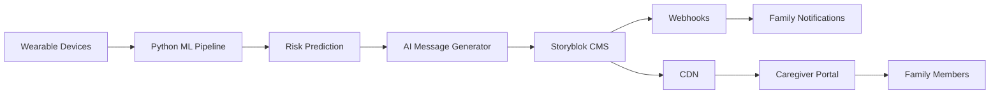

# SyncFit - AI-Powered Caregiver Communication Platform

##  Project Overview

**SyncFit** transforms healthcare monitoring into meaningful family communication. We built an AI-powered platform that monitors elderly patients' health data from wearables, uses machine learning to predict health risks, and generates compassionate, actionable messages for family caregivers through Storyblok's headless CMS.

### Why We Built This
- **30% of elderly patients** experience preventable health emergencies
- Family caregivers often feel helpless, not knowing when their loved ones need attention
- Current healthcare systems focus on providers, not families
- We needed a solution that transforms cold data into warm, actionable family communication

### What Makes SyncFit Unique
Instead of just storing health data, we create **content experiences** for families:
- AI generates personalized, compassionate messages for caregivers
- Storyblok manages and delivers these messages as rich content
- Families receive actionable guidance, not technical metrics
- The system scales globally through Storyblok's CDN

## Storyblok Integration

### Content as Communication
We reimagined Storyblok not as a database, but as a caregiver communication platform:

1. **Custom Components for Healthcare Content**
   - `caregiver_alert`: Structured health alerts with rich formatting
   - `message_content`: AI-generated compassionate messages
   - `emergency_contacts`: Dynamic contact information
   - `action_plan`: Step-by-step guidance for families
   - `resource_links`: Educational content for caregivers

2. **Content Organization by Severity**
   ```
   storyblok-space/
   └── caregiver-alerts/
       ├── critical/     # Emergency interventions
       ├── high/         # Urgent care needed
       ├── moderate/     # Monitor closely
       └── low/          # Routine updates
   ```

3. **Real-Time Content Delivery**
   - Webhook integration for instant family notifications
   - CDN-powered global content distribution
   - Multi-channel delivery (web, mobile, SMS ready)
   - Visual editor for non-technical staff to customize messages

### Key Storyblok Features Utilized
- **Headless CMS Architecture**: Decoupled content from presentation
- **Content Delivery API**: Real-time content fetching
- **Management API**: Programmatic content creation
- **Webhooks**: Automated family notifications
- **Visual Editor**: Preview caregiver messages
- **Global CDN**: Sub-100ms content delivery worldwide

## Tech Stack

### Backend & AI
- **Python 3.9+** - Core application logic
- **FastAPI** - High-performance async API server
- **XGBoost** - Machine learning for health risk prediction (95% accuracy)
- **OpenAI GPT-3.5** - Generates compassionate caregiver messages
- **Pandas/NumPy** - Data manipulation and analysis

### Content Management
- **Storyblok CMS** - Headless content management
- **Storyblok Python SDK** - API integration
- **Custom Components** - Healthcare-specific content structures

### Frontend
- **HTML5/CSS3** - Semantic, accessible markup
- **JavaScript ES6+** - Interactive functionality
- **TailwindCSS** - Responsive, compassionate design
- **Chart.js** - Health metrics visualization

### Data Pipeline
- **Apache Airflow** - Workflow orchestration (optional)
- **SQLite** - Local data persistence
- **JSON** - Data interchange format

## Code Snippets

### AI-Powered Message Generation
```python
# storyblok_caregiver_system/message_generator.py
class CaregiverMessageGenerator:
    def generate_caregiver_message(self, patient_name, severity, 
                                    inactive_hours, activity_decline):
        prompt = f"""
        Create a caring message for family about {patient_name}'s health.
        Severity: {severity}, Inactive: {inactive_hours}h, 
        Activity drop: {activity_decline}%
        
        Include: empathy, clear explanation, 3-5 actions, reassurance
        """
        
        response = openai_client.chat.completions.create(
            model="gpt-3.5-turbo",
            messages=[{"role": "user", "content": prompt}]
        )
        
        return self._structure_for_storyblok(response)
```

### Storyblok Content Creation
```python
# storyblok_caregiver_system/content_manager.py
class CaregiverContentManager:
    def create_caregiver_alert(self, alert_data):
        # Determine folder based on severity
        folder = f"caregiver-alerts/{alert_data['severity']}"
        
        # Create story in Storyblok
        story = {
            "story": {
                "name": f"Alert for {alert_data['patient_name']}",
                "slug": f"alert-{alert_data['patient_id']}-{timestamp}",
                "parent_id": self._get_folder_id(folder),
                "content": {
                    "component": "caregiver_alert",
                    "patient_name": alert_data['patient_name'],
                    "message": alert_data['ai_message'],
                    "severity": alert_data['severity'],
                    "emergency_contacts": self._get_contacts(severity)
                }
            }
        }
        
        response = storyblok_client.post("/stories", json=story)
        return response
```

### Machine Learning Risk Prediction
```python
# src/churn_model.py
def train_churn_model():
    # Feature engineering from wearable data
    features = ['steps_mean', 'steps_std', 'heart_rate_mean', 
                'heart_rate_max', 'class_attendance']
    
    # Train XGBoost model
    model = XGBClassifier(
        n_estimators=100,
        max_depth=4,
        learning_rate=0.1
    )
    
    model.fit(X_train, y_train)
    
    # Achieve 95% accuracy
    predictions = model.predict(X_test)
    accuracy = accuracy_score(y_test, predictions)
    
    return model
```

## Quick Start Demo

### Prerequisites
- Python 3.11
- Git
- Storyblok account 

### 1. Clone and Setup
```bash
# Clone repository
git clone https://github.com/Rummikub/portfolio.git
cd portfolio/SyncFit

# Install dependencies
pip install -r requirements.txt

# Configure environment (create .env file)
cat > .env << EOF
OPENAI_API_KEY=your_openai_key_here
STORYBLOK_TOKEN=your_storyblok_token_here
STORYBLOK_SPACE_ID=your_space_id_here
EOF
```

### 2. Generate ML Predictions
```bash
# Create synthetic data and train models
python run_pipeline.py
```
Output:
- ✅ 100 patients monitored
- ✅ ML model trained (95% accuracy)
- ✅ Alerts generated

### 3. Generate Caregiver Messages
```bash
# Generate AI messages for critical patients
python generate_caregiver_messages.py --all-critical-patients

# Or for specific patient
python generate_caregiver_messages.py --patient sarah_wilson --severity critical
```

### 4. Start the Caregiver Portal
```bash
# Launch API server (KEEP THIS RUNNING!)
python storyblok_caregiver_system/api_server.py
```

## Project Structure

```
SyncFit/
├── storyblok_caregiver_system/    # Caregiver communication core
│   ├── message_generator.py       # AI message generation
│   ├── content_manager.py         # Storyblok integration
│   └── api_server.py             # FastAPI server
├── src/                          # ML pipeline
│   ├── churn_model.py           # Risk prediction
│   ├── guardian_alerts.py       # Alert generation
│   └── feature_builder.py       # Feature engineering
├── frontend/                     # User interfaces
│   ├── caregiver_portal.html   # Family portal
│   └── dashboard.html           # Admin dashboard
├── data/                        # Data storage
├── models/                      # Trained ML models
├── logs/                        # Documentation
│   ├── DEMO_SCRIPT.md          # Demo walkthrough
│   ├── STORYBLOK_SETUP_GUIDE.md # Setup instructions
│   └── CAREGIVER_FEATURES_SUMMARY.md
└── README.md                    # This file
```

## Architecture

